# Enhancing Airbnb Revenue for New York  
*A Multi-Modal Data Strategy for Dynamic Price Modeling*

---

## Introduction

Airbnb is a home-sharing platform where property owners ("hosts") can list their spaces for short-term rentals. In competitive markets like New York City, hosts face a challenging pricing problem:  
- Setting prices too high can reduce bookings.  
- Setting prices too low can lead to lost revenue.  

This project focuses on designing a data-driven pricing strategy to help hosts maximize income while maintaining competitiveness.

---

## Objective

The objective of this project is to maximize the annual profit of Airbnb listings in New York City by addressing two core business needs:

1. Optimizing yearly profitability
2. Developing a dynamic, data-driven daily pricing model

This is achieved through:
- Clustering listings based on demand and location
- Predicting baseline prices through regression
- Recommending optimized prices using occupancy and cost models

---

## Analytics Workflow

**End-to-end modeling process includes:**

1. **Data Preprocessing**
   - Cleaning, imputation, encoding, normalization  
2. **Exploratory Data Analysis (EDA)**
   - Distribution, pricing trends, geospatial insights  
3. **Feature Engineering**
   - Text length, sentiment, proximity  
4. **Clustering**
   - k-means segmentation of listings  
5. **Regression Modeling**
   - Predicting price from listing attributes  
6. **Pricing Optimization**
   - Recommending ideal prices for maximum profit  

---

## Dataset Description

**Source**: [Inside Airbnb](http://insideairbnb.com/get-the-data.html)

**Scale**:  
- ~49,759 listings  
- ~75 listing attributes  

**Tables Used:**
- `listings.csv`: Price, location, availability, amenities, ratings  
- `reviews.csv`: Guest reviews, timestamps, text content  

---

## Data Preprocessing 

### Clustering

- Missing values were imputed (filled with zero or appropriate default)
- Unnecessary and redundant columns were dropped
- Categorical variables like `amenities` were numerically encoded
- Data was converted to NumPy arrays and normalized for clustering

---

### Regression Modeling

- Columns with irrelevant content (e.g., `picture_url`, `calendar_updated`) were removed
- Missing values were handled:
  - `host_response_time`: replaced with `"unknown"`
  - `host_response_rate`: converted to categorical
  - `host_is_superhost`: missing values replaced with `"false"`
  - `bathrooms`: missing → 1
  - `bedrooms` and `beds`: missing → median

---

### Review and Price Cleaning

- `price` field was parsed from string to numeric by removing currency symbols
- Listings without reviews were retained and flagged as `"unknown"`
- Review-related features were treated as categorical

---

### Categorical and Property Fields

- Amenities used in fewer than 10% of listings were excluded
- Property types were consolidated into broader categories:
  - `apartment`, `condo`, `hostel`, `svc_apt_hotel`

---

## Exploratory Data Analysis

---

### Histogram Analysis of Numerical Features

Histogram plots were created to analyze the distributions of key numerical features across the dataset. These include:

- `accommodates`
- `bathrooms`
- `bedrooms`
- `beds`
- `price`
- `minimum_nights`
- `maximum_nights`
- `availability_30`

Mean and median lines were overlaid to highlight skewed distributions.

**Image:**
- 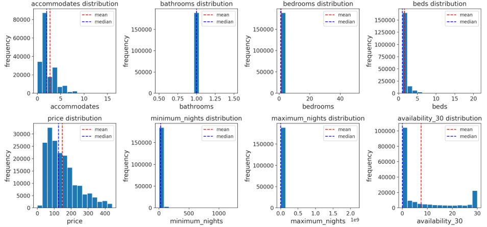

---

### Host Listing Duration in NYC

An analysis was conducted to determine how long hosts have been active on Airbnb in NYC.

Key finding:
- Many listings were relatively new (1–2 years), but some had been active for over 5 years.

**Image:**
- 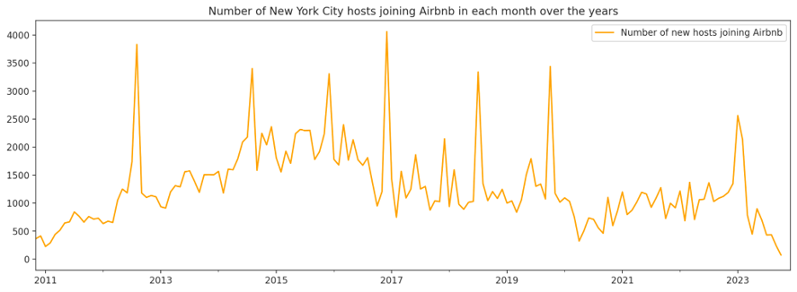

---

### Price Range Distribution

The dataset includes a wide range of listing prices:
- Minimum: $0  
- Maximum: $70,100  
- Most listings priced below $500

This wide range reinforces the need for customized pricing strategies rather than global heuristics.

---

### Price vs Categorical Features

Violin plots were used to visualize the distribution of prices across key categorical variables:

- Room type
- Property type
- Cancellation policy

These plots show:
- Entire home/apartment listings command higher prices  
- Hostels and shared rooms skew lower  
- Some cancellation policies are associated with higher nightly rates

**Image:**
- 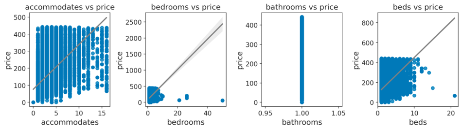

---

## Geospatial Analysis

---

### Mapping the Median Price

Choropleth maps were generated to visualize spatial pricing patterns across New York City.  

- Higher median prices were concentrated in central Manhattan and parts of Brooklyn.  
- Outlying boroughs showed relatively lower price bands.

**Image:**
- 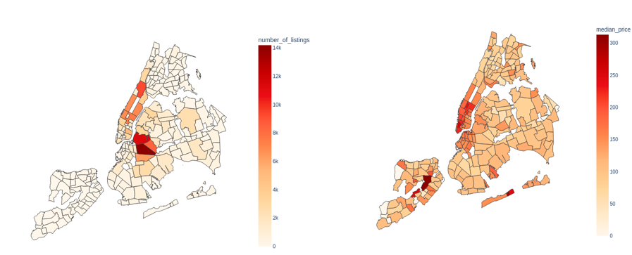

---

### Mapping the Number of Listings

Another choropleth layer was created to map the volume of listings per neighborhood.

- Manhattan and Brooklyn exhibited the highest listing counts.
- Some regions in Queens showed mid-level density.

**Image:**
- 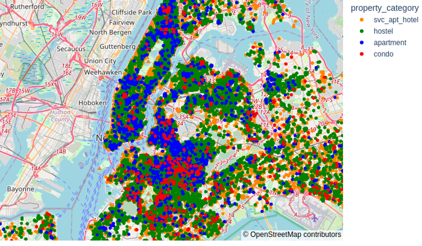

---

### Geospatial Insights: Cluster Map

Geographic clustering was used to visualize groupings of listings based on attributes such as location, price, and availability.  

The map showed distinct high-density rental zones and pricing clusters concentrated in well-connected boroughs.

**Image:**
- 

---

## Visual Analysis

---

### Violin Plots – Price vs Categorical Features

Violin plots were used to examine the distribution of listing prices across several key categorical variables:

- Room Type
- Property Type
- Cancellation Policy

Insights:
- Entire homes/apartments had the widest and highest price distributions.
- Shared rooms and hostels showed tighter, lower price ranges.
- Some cancellation policies aligned with premium pricing.

**Image:**
- 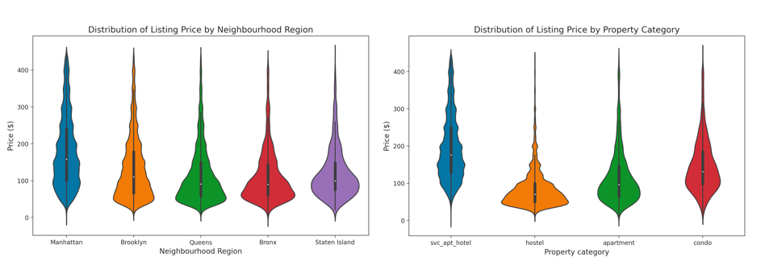

---

## Feature Engineering

Three custom features were engineered to improve model prediction quality:

1. **Description Length**  
   - Character count of listing descriptions  
   - Proxy for listing quality and detail

2. **Proximity to City Center**  
   - Approximate distance to Manhattan core  
   - Captures location-based pricing effects

3. **Review Sentiment Score**  
   - Sentiment analysis performed on review text  
   - Scaled from -1 (very negative) to +1 (very positive)

**Image:**
- 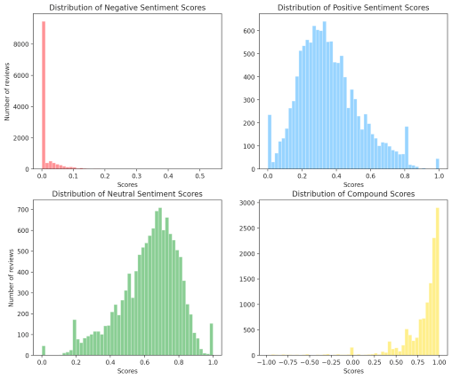

---

## Sentiment Analysis of Reviews

Review text was analyzed using sentiment scoring techniques to extract polarity values.

- Sentiment was extracted using a natural language processing tool.
- Scores were visualized with histograms and compared across room types.

This sentiment score was later used as a predictive feature in both clustering and price regression.

**Image:**
- 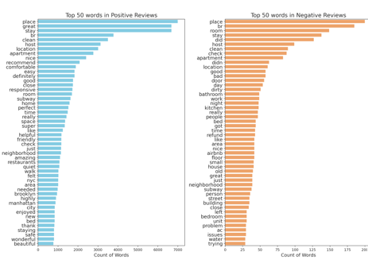

---

## Data Cleaning: Multicollinearity

To address multicollinearity, a correlation heatmap was generated for all numerical features.

- Highly correlated variables were flagged and reviewed for removal or transformation.
- This step was critical to prevent multicollinearity from biasing the regression and optimization models.

**Image:**
- 

---

## Feature Correlation with Price

Top features most strongly correlated with price were identified.

| Top 10 features with **positive** correlation | Top 10 features with **negative** correlation |
|-----------------------------------------------|-----------------------------------------------|
| amenities_count                                | shared_room                                   |
| description_length                             | hostel                                         |
| entire_home_room_type                          | long_minimum_nights                           |
| superhost_flag                                 | no_response_flag                              |
| location_score                                 | low_availability                              |
| recent_reviews                                 | low_rating                                     |
| high_review_sentiment                          | strict_cancellation_policy                    |
| high_response_rate                             | distance_from_center                          |
| short_booking_window                           | late_response_time                            |
| image_quality_score (planned)                  | low_image_count (planned)                     |

These features informed clustering, baseline price prediction, and downstream optimization logic.

**Image:**
- 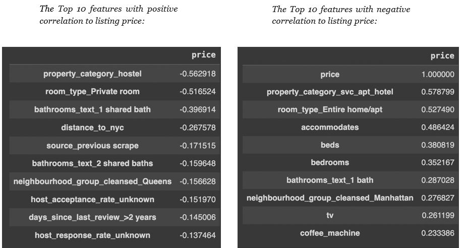

---

## Methodology: Occupancy Estimation

To support profit modeling, an estimation method was applied to calculate expected occupancy and yearly availability for each listing using publicly available review data.

### Step 1: Bookings per Month
Bookings_per_month = Reviews_per_month / Review_rate

### Step 2: Occupancy Rate
Occupancy = min((Bookings_per_month × Average_Nights) / 30, 0.95)

### Step 3: Estimated Annual Nights Booked
Annual_nights = Occupancy × Availability_365

**Assumptions:**
- Average Nights per stay: 4.5  
- Review Rate: 0.5  
- Maximum Occupancy: 95%

This logic was used to estimate the revenue-generating potential for each listing before applying optimization.

---

---

## Airbnb Listing Clustering & Price-Demand Analysis

### Clustering Approach  
K-Means clustering (K=3) was used to group Airbnb listings located within a 3-mile radius based on:

- Location (latitude, longitude)  
- Listing attributes  
- Historical pricing behavior

This segmentation helped define regional and behavioral price-demand dynamics.

### Demand Modeling  
A **polynomial regression** was fitted for each cluster to model demand (occupancy rate, Dij) as a function of price (xij), using:

**Equation:**  
Dij = α · xij² + ξ · xij + β

These demand curves were later used in optimization to identify profit-maximizing prices for each cluster.

---

## Baseline Price Prediction

Multiple regression models were trained to estimate baseline nightly prices. The XGBoost model outperformed all others in both accuracy and error metrics.

| Model              | Train R² | Test R² | Train RMSE | Test RMSE |
|--------------------|----------|---------|------------|-----------|
| **XGBRegressor**   | **0.87** | **0.81**| **0.22**    | **0.27**   |
| Elastic Net        | 0.62     | 0.63    | 63.1       | 62.3      |
| Ridge              | 0.62     | 0.63    | 62.9       | 62.2      |
| Lasso              | 0.61     | 0.62    | 63.6       | 62.9      |
| Linear Regression  | 0.62     | 0.63    | 62.9       | 62.2      |

The XGBoost model was used for final baseline pricing in the optimization pipeline.

---

## Baseline Price Prediction

A machine learning model was developed to predict a listing’s baseline nightly price before applying optimization adjustments.

**Model**: XGBoost Regressor  
**Performance**: R² = 0.81

**Top Features:**
- Property category (e.g., svc_apt_hotel, hostel, apartment)  
- Number of bedrooms and amenities  
- Host response time  
- Review timing and frequency  
- Availability and room type

The predicted price served as the starting point for final profit-based price recommendations.

**Image 1:**
- 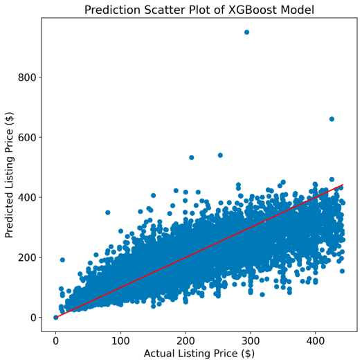

**Image 2:**
- 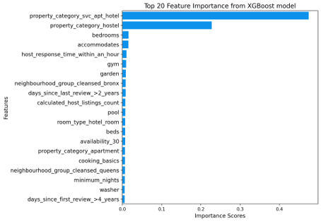

  ---

## Pricing Optimization Model

The pricing optimization model aims to maximize yearly profit across listing clusters, accounting for both demand behavior and cost variables.

### Objective:
Maximize total annual profit while adjusting for listing costs and investments.

### Decision Variables:
- αc,d: Binary indicator — whether a price adjustment is applied for cluster *c* on day *d*  
- xc,d: Continuous — the adjusted price for cluster *c* on day *d*

### Parameters:
- xc,d0: Baseline predicted price  
- Dc,d: Estimated demand on day *d*  
- Cv: Variable cost per listing  
- I0: Initial investment per cluster  

### Objective Function:
Profit = Σc,d [αc,d · (xc,d − Cv)] − I0  
Total profit is computed across all clusters and days.

### Constraints:
- xc,d = αc,d · xc,d0  
- Dc,d ≥ 0.5 · αc,d

### Solver:
Used IPOPT (Interior Point OPTimizer) with nonlinear constraint precision control.

### Outcome:
Optimized daily prices were generated for each cluster to enhance total profitability.

---

## Sample Output – Optimized Price Recommendation

A sample listing in Midtown Manhattan was evaluated using the optimized pricing model.

### Listing Attributes:
- Property type: svc_apt_hotel  
- Bedrooms: 1  
- Accommodates: 2  
- Host response time: within 1 hour  
- Amenities: Medium  
- Distance to NYC center: 1.7 miles  
- Initial investment: $23,424

### Output:
- **Baseline Price**: $205  
- **January Demand**: 20%  
- **Recommended Price**: $198  
- **Projected Yearly Profit**: $25,378

---

## Conclusion & Future Work

### Results:
- The machine learning model achieved an R² score of **0.81** in predicting listing prices.  
- The remaining **19% unexplained variance** highlights influence from untracked or qualitative factors such as images and seasonality.

### Future Enhancements:
- Integrate CNN-based models to evaluate image quality.  
- Use proprietary APIs (e.g., AirDNA) for more precise occupancy/pricing data.  
- Add proximity-based features (e.g., transit, landmarks).  
- Apply seasonal decomposition and forecasting in optimization logic.

